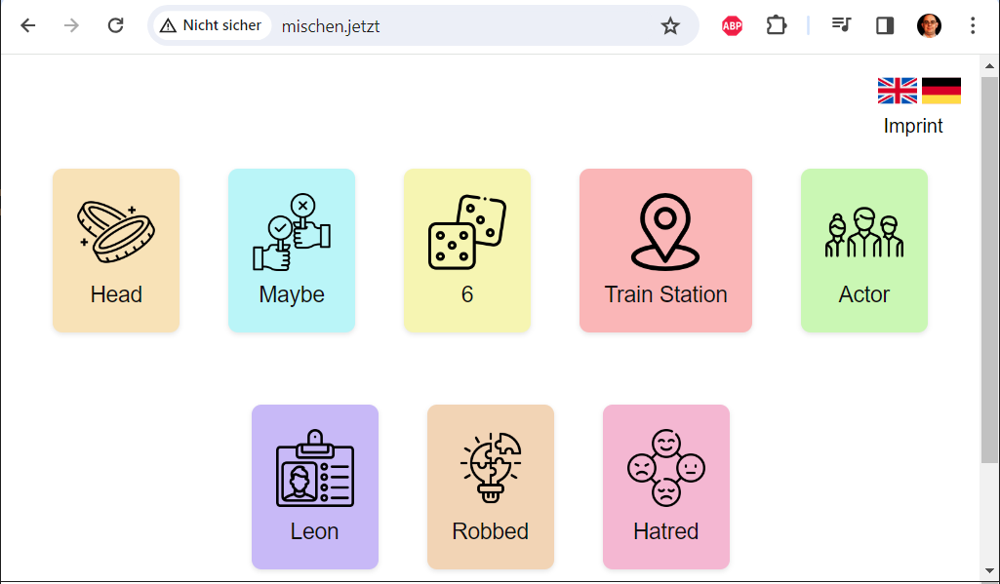

# Virtual Shuffle App

The Virtual Shuffle App is a simple web application that allows users to shuffle and interact with sets of cards in different languages. Users can switch between English and German card sets and shuffle the cards to reveal different words.

## Features

- Switch between English and German card sets.
- Shuffle cards to reveal different words.
- Responsive design for various screen sizes.

## Technologies Used

- HTML
- CSS
- JavaScript

## How to Use

1. Clone this repository to your local machine:
2. Navigate to the project directory:
3. Open `index.html` in your web browser to use the application.
4. Click on the English or German flag icons to switch between languages.
5. Click on a card to shuffle and reveal different words.

## Author

- [Com2u](https://github.com/com2u/mischen.jetzt)

## License

This project is licensed under the MIT License - see the [LICENSE.md](LICENSE.md) file for details.

## Acknowledgments

- Special thanks to [Flaticon](https://www.flaticon.com) for the card icons.
